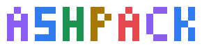

<p align="center"></p>

<p align="center">One drawer and one strip, shared by all your Claude Code mods.<br/>So they stop fighting over the footer and the band above the prompt.</p>

<p align="center">
  <a href="https://github.com/ashishsk93/ashpack/releases"></a>
  
  
  <a href="LICENSE"></a>
</p>

<p align="center"></p>

## Why

Every Claude Code mod wants the same two places: the footer and the row above the prompt. Three mods, three rows. AshPack is a host for those places:

- **The drawer**: a side panel with a tab per mod. Each mod's settings and controls live on its own page.
- **The strip**: one row above the prompt. Each mod puts a short chip there instead of a row of its own.

A mod joins with a single keyed Box; see [ADOPTING.md](ADOPTING.md). No import, no dependency: the host reads the trees the other mods draw. The host draws nothing else.

## The mods

| Mod | What it does | Command |
| --- | --- | --- |
| **ashpack** | The host: the drawer, the footer button `◆ AshPack ▸`, the strip | `/ashpack [page]` |
| **ashpack-status** | Status chips (model, branch, context, usage, and repo chips you can turn on), compact mode with a working popup, and an Activity page of every turn's tool calls | `/ashstatus [activity\|compact\|chips]` |
| **ashpack-skins** | Sixteen skins for prompts, replies, tool rows, cards, charts and the spinner, dark or light | `/skin [name\|on\|off\|dark\|light\|charts on\|charts off]` |

Each works alone; together they share the drawer and the strip. [Baton](https://github.com/ashishsk93/baton-mods) adopts the drawer too.

## Install

In a Claude Code session:

```
/plugin install ashpack --marketplace ashishsk93/ashpack
/plugin install ashpack-status --marketplace ashishsk93/ashpack
/plugin install ashpack-skins --marketplace ashishsk93/ashpack
```

Answer `y` to add the marketplace, pick a scope, then `/reload-plugins`. Install `ashpack` first: the host must be the first entry in `enabledPlugins` to see the other mods' pages and chips. If it is not, the drawer's Home page says so and offers `↑ move AshPack first`.

Update with `claude plugin marketplace update ashpack`, then `claude plugin update <mod>@ashpack`.

## ashpack · the host

<p align="center"></p>

The drawer (`◆ AshPack ▸` in the footer, or `/ashpack`), with **Home** and a tab per mod; the strip above the prompt with a chip per mod; the plugin-order check with its one-click fix. The page shown and the open state are kept across sessions. [Read more.](plugins/ashpack/README.md)

## ashpack-status · chips and compact mode

<p align="center"></p>

One row of chips: model, branch, context and usage, with segment bars that go green, amber, red. Four repo chips start off: the working tree, lines changed, the last commit, and the pull request with its checks. Compact mode folds the tool rows away and shows a popup with the work in progress, a wave loader beside the running step. The Activity page keeps every turn after the popup closes: the turn in view with its calls, the session's time, calls, lines and spend, a timeline, and a row per turn to bring back. [Read more.](plugins/ashpack-status/README.md)

## ashpack-skins · sixteen skins

<p align="center"></p>

Catppuccin, Dracula, Nord, Gruvbox, Tokyo Night, Rosé Pine, Solarized, One, Everforest, GitHub, Kanagawa, Monokai, Ayu, Night Owl, Poimandres and Mono, dark or light. The status chips and the working popup draw in the skin's colours too. Text colors only. In the desktop app, tool calls become rows with icons, edits diff cards, shell output terminal cards, and code and tables cards with a Copy button. ` ```mermaid ` fences draw as charts on both surfaces: flowcharts, sequence, state, class and ER diagrams, mind maps, pies, bar and line charts, timelines, Gantt and quadrant charts. Diff fences, alerts and task lists draw too. [Read more.](plugins/ashpack-skins/README.md)

## Give your mod a page and a chip

```tsx
on('ui.render', { component: 'Pane', requestId: 'ashpack' }, async ($, e, next) => {
  const below = await next(e) // keep the pages of the mods after yours
  const { Box, Text } = $.ui.resolve(e)
  return (
    <Box flexDirection="column">
      {below}
      <Box key="ashpack-page:Hello" flexDirection="column">
        <Text>Your page: any tree, Buttons included.</Text>
      </Box>
    </Box>
  )
})
```

A chip is the same idea in the band above the prompt: a Box keyed `ashpack-chip:hello`. Both work without the host too: the chip becomes a row of its own, and the page can go in a pane of yours. [ADOPTING.md](ADOPTING.md) has the whole protocol, the fallback, and the plugin-order rule. `scripts/new-mod.sh <name> "description" --page` scaffolds a mod that already does all of it.

## Develop

```bash
scripts/new-mod.sh <name> "one-line description" [--page]   # scaffold a mod and list it in the marketplace
scripts/check.sh [name]                                     # validate, test and type-check every mod, or one
```

From a clone: `claude plugin marketplace add /path/to/ashpack`, then `claude plugin install ashpack@ashpack`. Edits apply after `/reload-plugins`.

Mods run in a sandbox with no DOM and no Node. Code that uses `$` must be in the same file as the hook that uses it; pure helpers can live in other files. The type check uses the API types that Claude Code writes; if `check.sh` finds none, set `CLAUDE_CODE_TYPES` to the path of `claude-code.d.ts`.

## License

[MIT](LICENSE).
